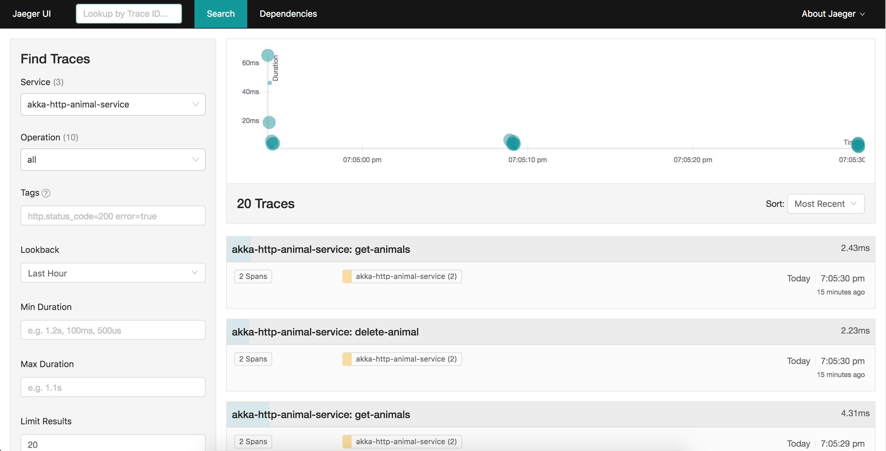
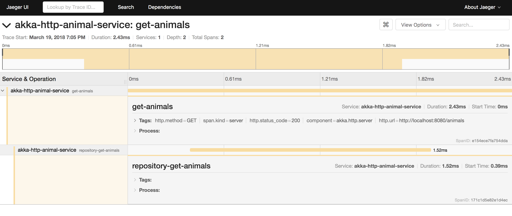

# Akka Http Animal Service

This repository contains a simple CRUD microservice for managing animals, which uses MongoDB.

The goal of this project is to show how to build a microservice using Scala and Akka Http. 

In this example, you can see how to:
- marshal/unmarshal http JSON responses/requests with circe
- handle errors
- use Monad Transformer in a real-world use case
- deploy it on Kubernetes using Helm chart
- prepare e2e tests suite and configure SBT to run them
- trace requests using Kamon and Jaeger
- ... and more

## Running

1. Clone the repository
```bash
git clone https://github.com/bszwej/akka-http-animal-service.git
```

1. Change dir 
```bash
cd akka-http-animal-service
```

1. Run docker compose using sbt. It spins up the microservice, MongoDB and Jaeger. 

```bash
sbt dockerComposeUp
```

1. Make some calls:

```bash
curl -X POST -H 'Content-Type: application/json' -d '{"name": "Charlie", "kind": "Unicorn", "age": 21}' http://localhost:8080/animals
curl http://localhost:8080/animals
```

1. Now go to Jaeger dashboard `http://192.168.99.100:31001` and see new traces.

You can find the API documentation [here](./docs/api.yaml).

In order to stop: `sbt dockerComposeStop`.

## Deployment

In the `deployment` directory, you can find Helm chart. You can use it to deploy this microservice on k8s.

Install on Kubernetes using Helm chart:

1. `helm install --name default-mongo stable/mongodb`
1. `helm install --name jaeger-standalone deployment/jaeger`
1. `helm install --name akka-http-animal-service deployment/microservice`

This is not a production deployment. However, it can be useful to play with locally on Minikube.

When running on Minikube:

- Service is accessible under `http://192.168.99.100:31000`
- Jaeger dashboard is accessible under `http://192.168.99.100:31001`

## Testing

This project contains unit, integration and e2e tests.

- run unit & integration `sbt test`
- run unit tests only `sbt "testOnly * -- -l tags.RequiresDb"`
- run integration tests only `sbt "testOnly * -- -n tags.RequiresDb"`

In order to run e2e tests:
1. Open up sbt shell: `sbt` 
1. `dockerComposeUp`
1. `e2e:tests` 
1. `dockerComposeStop`

You can point e2e tests to a different host with `url` flag:
- `sbt -Durl=http://192.168.99.100:31000 e2e:test`

## Jaeger tracing

This project uses Kamon to trace requests. After running the project using `sbt dockerComposeUp`, you can open Jaeger dashboard `http://localhost:16686/`.





